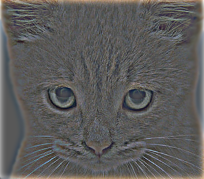
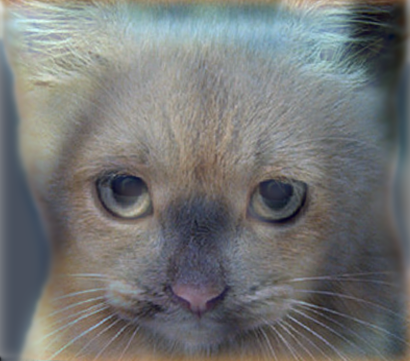
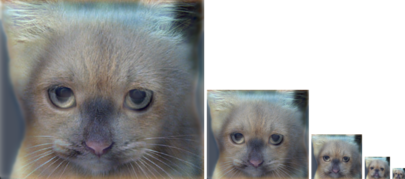
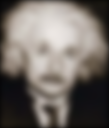
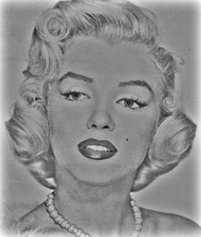
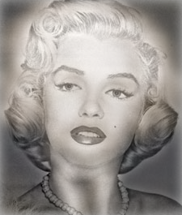
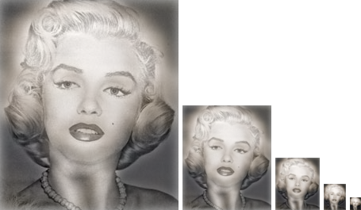

# 陳永慶 (103061122)

# Project 1 / Image Filtering and Hybrid Images

## Overview
The project is related to image filtering and hybrid image.

## Implementation

### Image Filtering (imfilter)
While implement the image filtering, padding is very important. First, we have to do the image padding and we choose the zero-padding. The padding size is determined by the filter size.

	height_padding = filter_height//2
	width_padding = filter_width//2
	image_padding = np.zeros([height_image + 2 * height_padding, 
							  width_image + 2 * width_padding, channel])
	for i in range(channel):
		image_padding[:,:,i] = np.lib.pad(image[:,:,i], 
						 	((height_padding, height_padding), 
						 	(width_padding, width_padding)), 
						 	'constant', constant_values = 0)

Calculate the convolution of three channels.

	for i in range(output_image.shape[1]):
		for j in range(output_image.shape[0]):
			output_image[j, i, 0] = np.sum(filter *
							image_padding[j:j+filter_height, i:i+filter_width, 0])
			output_image[j, i, 1] = np.sum(filter *
							image_padding[j:j+filter_height, i:i+filter_width, 1])
			output_image[j, i, 2] = np.sum(filter *
							image_padding[j:j+filter_height, i:i+filter_width, 2])

### Hybrid Image (proj1)
First, we have to produce the high-pass filter and low-pass filter. We choose the gaussian filter as low-pass filter. And using the original image minus low-pass filtered image as high-pass filtered image. But the high-pass filtered image has the negative value, so I normailized the high-pass filtered image. Finally, we sum the low-pass and high-pass image and normalized it. In order to find the change between the hybrid image, we downsampling the hybrid image.

	cutoff_frequency = 7
	gaussian_filter = gauss2D(shape=(cutoff_frequency*4+1,cutoff_frequency*4+1),
									 sigma = cutoff_frequency)
	low_frequencies = my_imfilter(I_1, gaussian_filter)
	high_frequencies = I_2 - my_imfilter(I_2, gaussian_filter)
	high_frequencies = normalize(high_frequencies)
	hybrid_image = normalize(low_frequencies + high_frequencies)
	vis = vis_hybrid_image(hybrid_image)

## Result

<table border=1>
<tr>
<td>

</td>
</tr>

<tr>
<td>

</td>
</tr>

</table>

## Discussion
It is hard to produce a good hybrid image. Because it's hard to find the approximate cutoff frequency. And two images must have the same architecture or two images won't match. 